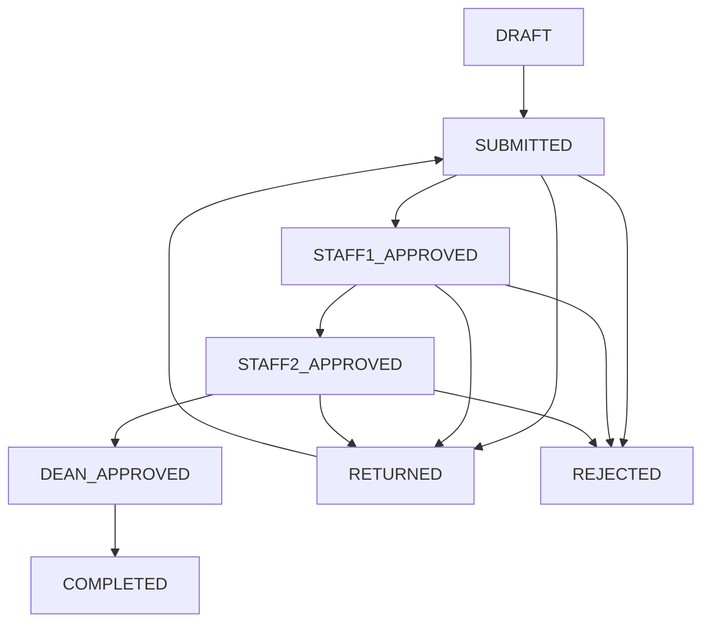

# UniKL STRG System

> **System for Travel Request Grant Management** - A comprehensive Laravel-based workflow platform for managing grant requests with multi-stage approvals, audit trails, and automated document generation.

---

## Table of Contents

- [System Overview](#system-overview)
- [Key Features](#key-features)
- [Technical Architecture](#technical-architecture)
- [Installation & Setup](#installation--setup)
- [User Roles & Workflow](#user-roles--workflow)
- [Development Guide](#development-guide)
- [Testing & Quality Assurance](#testing--quality-assurance)
- [Deployment](#deployment)
- [Troubleshooting](#troubleshooting)
- [API Documentation](#api-documentation)
- [Contributing Guidelines](#contributing-guidelines)

---

## System Overview

The UniKL STRG System is a **production-ready enterprise application** designed to streamline the grant request management process within academic institutions. The system provides a secure, scalable, and user-friendly platform for managing request workflows from submission through final approval.

### Business Objectives

- **Streamline Workflow**: Reduce manual processing time and eliminate paperwork
- **Enhance Accountability**: Maintain comprehensive audit trails for all actions
- **Improve Efficiency**: Automate routine tasks and provide real-time status tracking
- **Ensure Compliance**: Maintain proper documentation and approval processes

### System Capabilities

- **Multi-Role Access Control**: Granular permissions for different user types
- **Dynamic Form Generation**: Configurable request types with custom fields
- **Real-Time Notifications**: Automated alerts for workflow transitions
- **Document Management**: Automated PDF generation with digital signatures
- **Analytics & Reporting**: Comprehensive data export and analysis tools

---

## Key Features

### Workflow Management

- **Role-Based Dashboards**: Tailored interfaces for Admission, Staff 1, Staff 2, and Dean roles
- **State Machine Implementation**: Controlled workflow transitions with validation
- **Revision Management**: Structured return and resubmission processes
- **Priority Management**: Automatic and manual priority assignment based on deadlines

### Document Processing

- **Dynamic PDF Generation**: Professional document creation with embedded data
- **Digital Signature Capture**: Multi-role signature integration with audit trails
- **Template Management**: Configurable templates for different request types
- **File Upload System**: Secure document storage and retrieval

### Administrative Tools

- **User Management**: Role-based user administration with profile management
- **System Analytics**: Real-time statistics and performance metrics
- **Export Capabilities**: Advanced data export in multiple formats (CSV, Excel, PDF)
- **Override System**: Emergency bypass capabilities for urgent requests

### Security & Compliance

- **Comprehensive Audit Trail**: Complete logging of all system activities
- **Input Validation**: Robust validation rules and sanitization
- **Authentication & Authorization**: Secure access control with role-based permissions
- **Data Protection**: Sensitive information handling and secure storage

---

## Technical Architecture

### Technology Stack

- **Backend Framework**: Laravel 13.0 with PHP 8.3+
- **Frontend**: Blade templating with Tailwind CSS and Vite
- **Database**: SQLite (development) / MySQL (production)
- **Document Processing**: DomPDF, PhpSpreadsheet, FPDI
- **Authentication**: Laravel's built-in authentication system

### Design Patterns

- **Service Layer Architecture**: Business logic separation from controllers
- **Repository Pattern**: Data access abstraction
- **Policy-Based Authorization**: Granular permission management
- **Event-Driven Architecture**: Decoupled system components

### Database Schema

- **31 Migration Files**: Comprehensive database structure
- **Normalized Design**: Proper relationships and constraints
- **Audit Tables**: Complete tracking of system activities
- **Index Optimization**: Performance-focused database design

---

## Installation & Setup

### Prerequisites

- PHP 8.3 or higher
- Composer 2.0 or higher
- Node.js 18.0 or higher
- MySQL 8.0 or SQLite 3.x

### Quick Installation

```bash
# Clone the repository
git clone <repository-url> unikl-strg
cd unikl-strg

# Install dependencies
composer install
npm install

# Environment configuration
cp .env.example .env
php artisan key:generate

# Database setup
php artisan migrate --seed

# Start development server
composer run dev
```

### Environment Configuration

```env
# Application Settings
APP_NAME="UniKL STRG System"
APP_ENV=local
APP_DEBUG=true
APP_URL=http://localhost

# Database Configuration
DB_CONNECTION=sqlite
DB_DATABASE=database/database.sqlite

# Email Configuration (for notifications)
MAIL_MAILER=smtp
MAIL_HOST=127.0.0.1
MAIL_PORT=1025
MAIL_USERNAME=null
MAIL_PASSWORD=null

# Feature Flags
FEATURE_DEAN_INTERFACE=true
FEATURE_OVERRIDE_SYSTEM=true
```

---

## User Roles & Workflow

### Role Definitions

| Role | Responsibilities | Permissions |
|------|------------------|-------------|
| **Admission** | Submit and revise requests | Create, edit own requests, view status |
| **Staff 1** | Verify request details | View all requests, verify, return with notes |
| **Staff 2** | Recommend and prepare | Verify, recommend, override capabilities |
| **Dean** | Final approval | Approve, reject, system administration |

### Workflow States



### Demo Accounts

All accounts use password: `password`

- **Admission**: admissions@unikl.edu.my
- **Staff 1**: staff1@unikl.edu.my
- **Staff 2**: staff2@unikl.edu.my
- **Dean**: dean@unikl.edu.my

---

## Development Guide

### Code Structure

```
app/
|-- Console/Commands/          # Artisan commands
|-- Http/
|   |-- Controllers/          # Request handlers
|   |-- Middleware/           # Request processing
|   |-- Requests/            # Input validation
|-- Models/                   # Eloquent models
|-- Policies/                 # Authorization logic
|-- Services/                 # Business logic
|-- Enums/                    # System constants
```

### Development Commands

```bash
# Run tests
php artisan test

# Code formatting
./vendor/bin/pint

# Generate documentation
php artisan docs:generate

# Clear caches
php artisan optimize:clear

# Queue worker (if using queues)
php artisan queue:work
```

### Coding Standards

- **PSR-12**: Follow PHP coding standards
- **Laravel Conventions**: Use framework best practices
- **Type Declarations**: Strong typing where applicable
- **Documentation**: Comprehensive PHPDoc blocks

---

## Testing & Quality Assurance

### Test Suite

```bash
# Run all tests
php artisan test

# Run specific test
php artisan test --filter RequestTest

# Generate coverage report
php artisan test --coverage
```

### Quality Checks

```bash
# Static analysis
./vendor/bin/phpstan analyse

# Code style check
./vendor/bin/pint --test

# Security audit
composer audit
```

### Performance Monitoring

```bash
# Production readiness check
php scripts/production-readiness-check.php

# Database optimization
php artisan db:optimize

# Cache warm-up
php artisan cache:warm
```

---

## Deployment

### Production Setup

```bash
# Install production dependencies
composer install --no-dev --optimize-autoloader
npm ci --production

# Environment configuration
cp .env.example .env
php artisan key:generate
php artisan config:cache
php artisan route:cache
php artisan view:cache

# Database migration
php artisan migrate --force

# Link storage
php artisan storage:link
```

### Security Considerations

- Disable debug mode in production
- Configure proper file permissions
- Set up SSL certificates
- Implement rate limiting
- Regular security updates

### Monitoring & Logging

- Configure application logging
- Set up error tracking (Sentry recommended)
- Monitor system performance
- Regular backup procedures

---

## Troubleshooting

### Common Issues

**Missing Dependencies**
```bash
composer install --optimize-autoloader
npm ci
```

**Database Issues**
```bash
php artisan migrate:fresh --seed
php artisan db:show
```

**Cache Problems**
```bash
php artisan optimize:clear
php artisan config:clear
php artisan route:clear
```

**Permission Issues**
```bash
chmod -R 755 storage/
chmod -R 755 bootstrap/cache/
```

### Debug Mode

Enable detailed error reporting:
```env
APP_DEBUG=true
LOG_LEVEL=debug
```

---

## API Documentation

### Authentication

All API endpoints require authentication via Laravel's built-in session system.

### Endpoints

| Method | Endpoint | Description |
|--------|----------|-------------|
| GET | `/api/requests` | List requests (filtered by role) |
| POST | `/api/requests` | Create new request |
| GET | `/api/requests/{id}` | Get request details |
| PATCH | `/api/requests/{id}/status` | Update request status |
| GET | `/api/users` | List users (admin only) |

### Response Format

```json
{
  "success": true,
  "data": {
    "id": 1,
    "ref_number": "STRG-2024-001",
    "status": "submitted"
  },
  "message": "Request created successfully"
}
```

---

## Contributing Guidelines

### Development Workflow

1. Create feature branch from `main`
2. Implement changes with tests
3. Run quality assurance checks
4. Submit pull request with description
5. Code review and merge

### Code Review Standards

- Follow existing code patterns
- Include tests for new features
- Update documentation as needed
- Ensure backward compatibility

### Release Process

1. Update version numbers
2. Update CHANGELOG.md
3. Tag release in Git
4. Deploy to staging environment
5. Production deployment after approval

---

## License & Support

This project is proprietary software developed for UniKL internal use. All rights reserved.

**Support Contact**: IT Support Department  
**Documentation**: Internal Wiki  
**Issue Reporting**: Help Desk System

---

*Last Updated: April 2026*  
*Version: 1.0.0*
